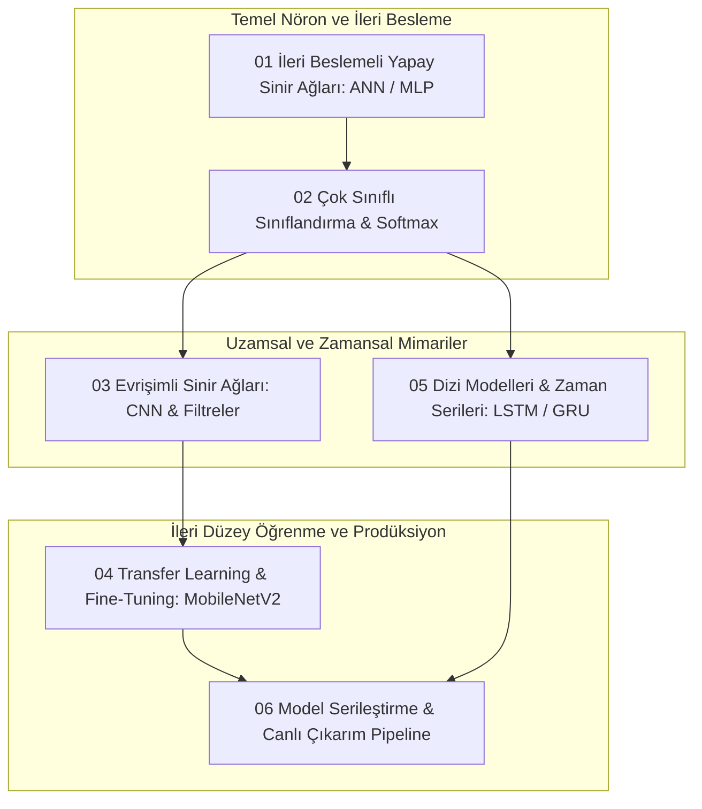

# Derin Öğrenme ve Yapay Sinir Ağları Yol Haritası


Bu repository; sıfırdan derin öğrenme (Deep Learning) ve yapay sinir ağları (Artificial Neural Networks) dünyasına adım atan bir mühendisin adım adım takip edebileceği **yapılandırılmış bir eğitim şablonu ve uygulama yol haritasıdır**. Temel çok katmanlı algılayıcılardan (MLP/ANN) evrişimli sinir ağlarına (CNN), transfer öğrenmeden dağıtım hattına (deployment) uzanan eksiksiz bir müfredat sunar.

---

## Müfredat ve Derin Öğrenme Pipeline Akışı



---

## Müfredat ve Modül Haritası

| No | Modül Adı | Mimari / Yöntem | Matematiksel Odak | Durum | Dizin |
|:---|:---|:---|:---|:---|:---|
| **01** | İleri Beslemeli Ağlar (ANN) | Keras Sequential API, Dense | İleri Yayılım, ReLU, Geri Yayılım (Backprop) | Tamamlandı | `01-ileri-beslemeli-yapay-sinir-aglari-ann/` |
| **02** | Çok Sınıflı Sınıflandırma | Softmax Aktivasyonu, Cross-Entropy | Olasılık Dağılımı Vektörü, Log-Loss | Tamamlandı | `02-cok-sinifli-siniflandirma-ve-softmax/` |
| **03** | Evrişimli Sinir Ağları (CNN) | Conv2D, MaxPool, Dropout, MNIST | 2B Ayrık Konvolüsyon, Öznitelik Haritaları | Tamamlandı | `03-evrisimli-sinir-aglari-cnn/` |
| **04** | Transfer Learning & Fine-Tuning | MobileNetV2 / ResNet50, ImageNet | Dondurulmuş Katmanlar, Özellik Çıkarıcı | Tamamlandı | `04-transfer-learning-ve-hazir-modeller/` |
| **05** | Tekrarlayan Sinir Ağları (RNN/LSTM)| LSTM / GRU Hücreleri | Zaman Adımları, Unutma Kapısı (Forget Gate) | Tamamlandı | `05-tekrarlayan-sinir-aglari-rnn-ve-lstm/` |
| **06** | Model Kaydetme & Canlı Çıkarım | `.keras` / SavedModel, Inference API | Model Serileştirme, Canlı Girdi Pipeline | Tamamlandı | `06-model-kaydetme-ve-cikarim-inference/` |

---

## 1. İleri Beslemeli Yapay Sinir Ağları (ANN / MLP)

Bir yapay nöronun girdi vektörünü ağırlıklar matrisi ile çarparak aktivasyon fonksiyonundan geçirmesi süreci:
- **İleri Yayılım (Forward Propagation):**
  $$z = W \cdot x + b$$
  $$a = \sigma(z) = \max(0, z) \quad (	ext{ReLU})$$
- **Geriye Yayılım (Backpropagation) ve Gradyan İnişi:** Kayıp fonksiyonunun $L$ ağırlıklara göre kısmi türevi zincir kuralı (Chain Rule) ile hesaplanır:
  $$rac{\partial L}{\partial W} = rac{\partial L}{\partial a} \cdot rac{\partial a}{\partial z} \cdot rac{\partial z}{\partial W}$$
  $$W \leftarrow W - lpha rac{\partial L}{\partial W}$$

---

## 2. Çok Sınıflı Sınıflandırma ve Softmax Çıktı Katmanı

$K$ adet sınıfa ait ham logit değerlerini toplanabilir olasılık dağılımına dönüştürür:
- **Softmax Dönüşümü:**
  $$\sigma(z)_i = rac{e^{z_i}}{\sum_{j=1}^K e^{z_j}}, \quad \sum_{i=1}^K \sigma(z)_i = 1$$
- **Kategorik Çapraz Entropi (Categorical Cross-Entropy):**
  $$L = -\sum_{i=1}^K y_i \log(\hat{y}_i)$$

---

## 3. Evrişimli Sinir Ağları (CNN)

Görüntülerdeki uzamsal hiyerarşiyi (kenarlar $
ightarrow$ dokular $
ightarrow$ nesne parçaları) yakalayan mimari:
- **2 Boyutlu Konvolüsyon:**
  $$(I * K)(i, j) = \sum_{m} \sum_{n} I(i - m, j - n) K(m, n)$$
- **Maksimum Havuzlama (MaxPooling2D):** Uzamsal boyutu yarıya indirerek hesaplama yükünü azaltır ve öteleme değişmezliği (translation invariance) sağlar.
- **Dropout Düzenlileştirmesi:** Eğitim sırasında nöronların rastgele bir kısmını devre dışı bırakarak aşırı öğrenmeyi (overfitting) engeller.

---

## Yol Haritası Gelişim Durumu (6/6 Modül Tamamlandı)

Tüm temel ve ileri düzey derin öğrenme modülleri eksiksiz olarak kodlanmış ve doğrulanmıştır:
- [x] **Modül 01:** İleri Beslemeli Ağlar (ANN & Keras Sequential API)
- [x] **Modül 02:** Çok Sınıflı Sınıflandırma ve Softmax
- [x] **Modül 03:** Evrişimli Sinir Ağları (CNN & MNIST)
- [x] **Modül 04:** Transfer Learning ve Fine-Tuning (MobileNetV2)
- [x] **Modül 05:** Tekrarlayan Sinir Ağları (RNN & LSTM ile Zaman Serisi Tahmini)
- [x] **Modül 06:** Model Serileştirme ve Canlı Çıkarım (Keras v3 Inference Pipeline)

---

## Kurulum ve Çalıştırma

```bash
git clone https://github.com/SuleymanToklu/deep-learning-foundations.git
cd deep-learning-foundations

python3 -m venv venv
source venv/bin/activate
pip install tensorflow numpy matplotlib pandas scikit-learn jupyter

jupyter notebook
```
